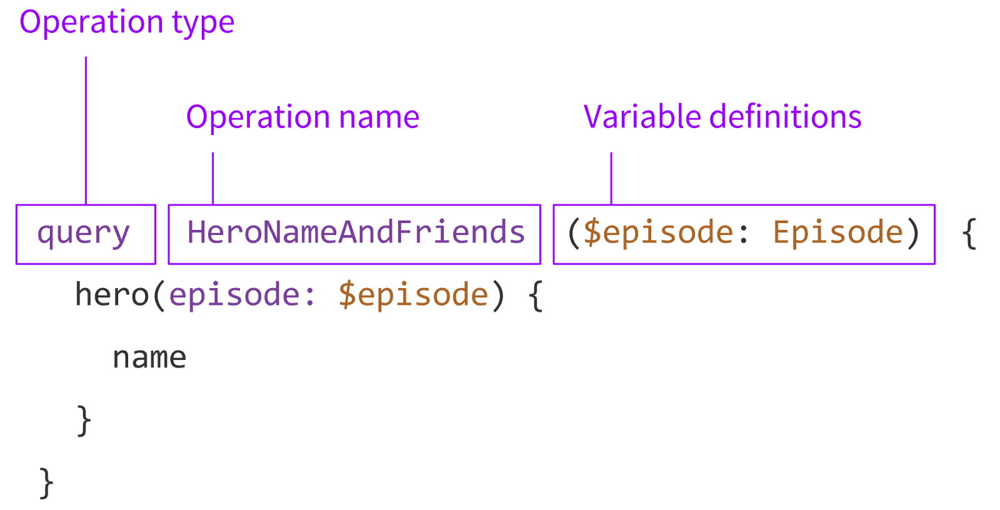

Обзор (Overview)
==================

Цель (Objective)
------------------
1. :ref:`Описать алгоритм составления http запросов. <description>`
2. :ref:`Обзор GraphQL документа. <graphql_document>`
3. :ref:`Составление GraphQL документа. <graphql_build_doc>`
4. :doc:`Предоставить пример и описание нескольких документов </search_products>`.
5. :ref:`Предоставить файл с результатами интроспекции <introspection>`.
6. :ref:`Предоставить особенности работы api <notes>`.

.. _description:

Описание (Description)
------------------------
.. Конечная точка

Взаимодействие с ``walmart back-end api`` происходит через https протокол. \
Основная конечная точка, на которую выполняются запросы::

    https://www.walmart.com/orchestra/home/graphql

Она также может иметь дополнительные сегменты пути (будут приведены для каждого запроса в описании), но фактически они не на что не влияют.

.. Тело

Тело запроса состоит из

- query - GraphQL документ.
- variables - переменные для query.

.. Заголовоки

Обязательными заголовки:
::

    Accept: application/json
    Content-Type: application/json
    WM_MP: True
    X-APOLLO-OPERATION-NAME: AnyOperationName

.. _graphql_document:

GraphQL документ (GraphQL document)
---------------------------------------

.. tab:: Документ GraphQL (GraphQL document)

    .. admonition:: Определение (Definition)
        :class: note

        ``Документ GraphQL (GraphQL document)``. Строка на языке GraphQl, описывающая одну или несколько операций или фрагментов.

.. tab:: Операция (Operation)

    .. admonition:: Определение (Definition)
        :class: note

        ``Операция (Operation)``. Единичный запрос данных, мутация или подписка, которые интерпретирует исполняемый модуль GraphQL.

Общий вид документа GraphQL::

    %operation type% %Operation name%(%variable definitions%){
        %selection set%
        %field%(%argument%){
            %field%
        }
    }

.. tab:: Тип операции (Operation type)

    .. admonition:: Определение (Definition)
        :class: note

        ``Тип операции (Operation type)``. Возможно одно из трех значений: query, mutation, subscription, что указывает на тип выполняемой операции.

.. tab:: Имя операции (Operation name)

    .. admonition:: Определение (Definition)
        :class: note

        ``Имя операции (Operation name)``. Имя операции подобно имени функции в языке программирования.

.. tab:: Определение переменных (Variable definitions)

    .. admonition:: Определение (Definition)
        :class: note

        ``Определение переменных (Variable definitions)``. Запрос GraphQL может иметь динамическую часть, которая меняется при разных обращениях к серверу, в то время как текст запроса остается постоянным. Это переменные запроса.

.. tab:: Выборка (Selection set)

    .. admonition:: Определение (Definition)
        :class: note

        ``Выборка (Selection set)``. Набор полей, запрашиваемых в операции или внутри другого поля. Для поля необходимо указать выборку, если поле возвращает объектный тип данных. Напротив, для скалярных полей типа Int и String не допускается указывать выборку.

.. tab:: Поле (Field)

    .. admonition:: Определение (Definition)
        :class: note

        ``Поле (Field)``. Единица запрашиваемых данных, которая становится полем в ответе JSON.

.. tab:: Аргументы (Arguments)

    .. admonition:: Определение (Definition)
        :class: note

        ``Аргументы (Arguments)``. Набор пар ключ-значение, связанных с конкретным полем. Они передаются на сервер обработчику поля и влияют на получение данных.

Переменные передаются отдельно от текста запроса в формате. GraphQL обычно используется JSON. Пример::

    {
        "some_variables": "Some value"
    }

.. admonition:: Определение (Definition)
    :class: note

    ``Переменные (Variables)``. Словарь значений, сопутствующий операции GraphQL. Содержит динамические параметры операции.

Дополнительные возможности GraphQL (необязательно):

- `Фрагменты (fragments) <https://graphql.org/learn/queries/#fragments>`_
- `Директивы (directives) <https://graphql.org/learn/queries/#directives>`_

.. _graphql_build_doc:

Алгоритм построения GraphQL документа (GraphQL document building algorithm)
-----------------------------------------------------------------------------

Для walmart backend GraphQL schema определены 2 специальных типа:

- Query - объект, для построения запросов на извлечения данных. Документация сфокусирована на этом типе запроса.
- Mutation - объект, для внесение изменений(мутаций) на стороне сервера. Документация не покрывает этот тип запросов.

В файле с результатами интроспекции содержится описание полей для объекта Query, которые можно извлечь,
указав их в секции `%selection set%`. Поле fields содержит порядка 102 типов. Описание для каждого типа содержится в:

- name - содержит название типа.
- description - описание типа
- args - аргументы, которые принимает тип.
- type - тип возвращаемого объекта.
- isDeprecated - была ли прекращена поддержка типа.
- deprecationReason - причина прекращения поддержки типа.

Итого окончательный алгоритм построение GraphQL документа:

1. Указать тип операции. В данном случае всегда будет query::

    query

2. Указать имя операции. Имя должно соответствовать правилам именованию переменных в языка Closure. Также это имя необходимо продублировать в заголовке X-APOLLO-OPERATION-NAME::

    query AnyOperationName(...)

3. Указать все необходимые переменные для AnyOperationName. Определиться какие поля нужно извлечь (см. Query.fields), какие переменные (см. args) для них будут нужны. Значения, подставляемые в переменные, должны быть указаны в формате ключ-значение поля variables в теле https запроса::

    query AnyOperationName($var1:String, $var2:Int, ...)

4. Заполнить секцию выборки выбранными полями::

    query AnyOperationName($var1:String, $var2:Int, ...){
        field1(arg1:$var1){
            field11
        }
        field2(arg2:$var2){
            field22
        }
    }

.. _introspection:

Интроспекция (Introspection)
------------------------------

`GraphQL schema <https://graphql.org/learn/schema/>`_ можно `интроспектировать <https://graphql.org/learn/introspection/>`_.
Результат интроспекции :download:`introspection result <jsons/introspection_result.json5>`.
Все описанные выше типы/объекты содержаться в этом файле.

.. _notes:

Заметки (Notes)
-----------------

- Локация. Локация отслеживается по кукам ACID и locDataV3.
    - ACID - uuid4, сгенерированный на стороне сервере.
    - .. collapse:: locDataV3 cookie - json с информацией о локации закодированный в base64 строку. Должен содержать релевантный ACID и временные отметки.

        .. literalinclude:: jsons/location_data_v3_cookie.json5
            :caption: locDataV3 cookie
            :linenos:
            :emphasize-lines: 77,80,84,85
            :language: json
- Корректность данных. Известно о:
    - неправильной сортировки по цене при поиске
    - дублирование товаров при поиске
    - неправильное определение офферов
    - временных ошибках: 500, idmlClient_ERROR, UNAUTHENTICATED, etc.
    - отсутствие item_id у товаров
